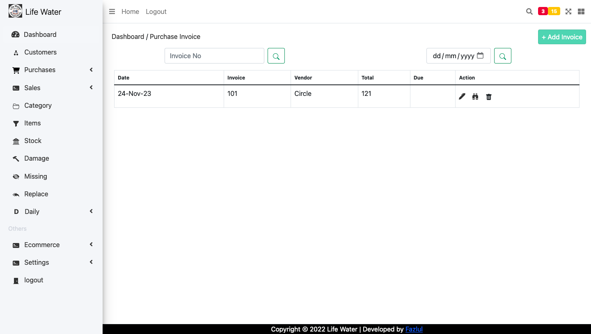

# Distributor App



[](https://your-build-url)
[](https://github.com/Fazlul69/distributor_app/blob/main/LICENSE.md)

Distributor App is a comprehensive inventory management application designed for distributors, providing a streamlined solution for tracking purchases, sales, returns, and damaged products. This open-source app is tailored to meet the unique needs of distributor businesses, offering robust features and a user-friendly interface.

## Table of Contents

- [Key Features](#key-features)
- [How to Use](#how-to-use)
- [Getting Started](#getting-started)
- [Contributing](#contributing)
- [License](#license)
- [Acknowledgments](#acknowledgments)

## Key Features

- **Purchase Management:** Easily add and manage product purchases from suppliers or companies.
- **Sales Tracking:** Record and monitor product sales with detailed customer information.
- **Product Returns:** Seamlessly handle product returns, ensuring accurate inventory management.
- **Damage Tracking:** Keep track of damaged products and manage them efficiently.
- **Reports and Ledgers:** Generate insightful reports, including customer-wise and monthly ledgers for a comprehensive overview.

## How to Use

1. **Purchase Products:** Start by adding purchased products from suppliers.
2. **Record Sales:** Log sales transactions with relevant customer details.
3. **Manage Returns and Damages:** Handle returns and damaged products to maintain accurate inventory.
4. **Generate Reports:** Utilize the reporting feature to obtain customer-wise and monthly ledgers.

## Getting Started

1. **Clone the repository:**

   ```bash
   git clone https://github.com/Fazlul69/distributor_app.git
